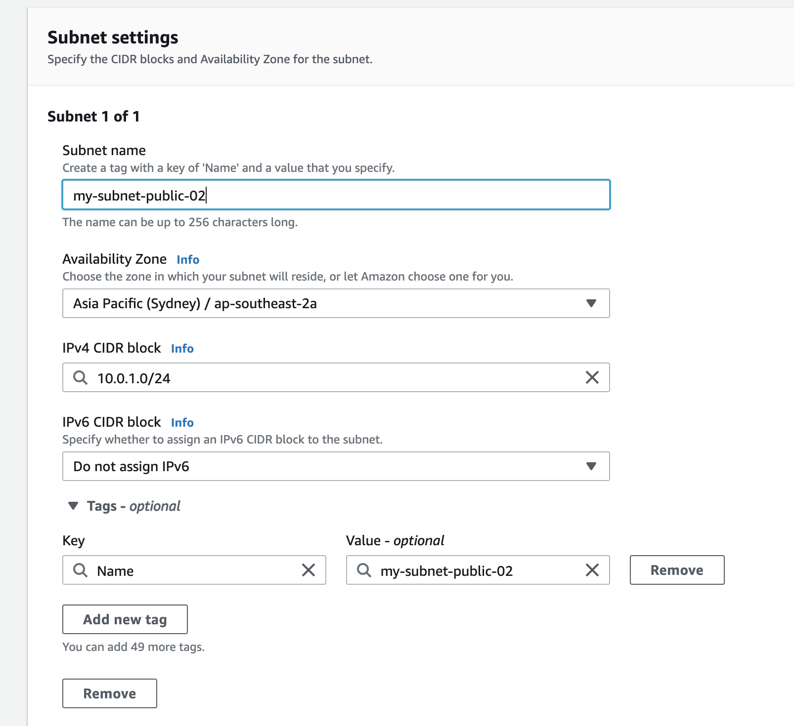
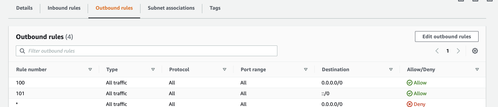

# VPC

# 1. Create new VPC
- Click `Create VPC`
- Set a value to `Name-tag`, it's optional
- Fill `IPv4 CIDR block`
You can click [here](https://cidr.xyz) to calculate your IPv4 CIRD
you can use `10.0.0.0/16`
- Select `Amazon-provided IPv6 CIDR block` for `IPv6 CIDR block`
- Choose `default` for `Tenancy`
- Create new VPC
## After create a new VPC
When a new VPC created, some services are build a new one by default. 
- Subnets: no 
- Internet gateway: no 
- Route tables: yes 
- Network ACLs: yes 
- Security groups: yes 
# 2. Create Subnet
Create 2 subnets under the VPC, set one whose `IPv4 CIDR block` is `10.0.1.0/24`  to public and another one whose `IPv4 CIDR block` is `10.0.2.0/24`  is private.
## Create
- Click `Create Subnet`
- Choose VPC
- Subnet settings as below

    - IPv4 CIDR block. 
    - IPv6 CIDR block.
- Create
## Set to public
After create a new subnet, choose the subnet Actions --> Modify auto-assign IP settings --> choose `Enable auto-assign public IPv4 address`

# 3. Create Internet GateWay
igw
- Click `Create Create internet gateway`
- Actions --> `Attach to VPC`

# 4. Configure Route table
The subnets created are attached to default rtb
- Create route table
- Add tag
- Choose VPC
- Create
## Attach the public subnet to created route table
Subnet Associations --> Edit subnet associations
## Edit route for public rtb
Routes --> Edit routes
- set Destination to `0.0.0.0/0` and target to igw
- set Destination to `::/0` and target to igw

# 5. Create instances
- Launch instances
- Select `Amazon Linux 2 AMI (HVM), SSD Volume Type`
- Choose an Instance Type
- Choose VPC
- Choose subnet
    - Choose the public subnet as a public subnet
    - Choose the private subnet as a private subnet
- Add Storage
- Add Tags
Add a `Name` tag: key = Name; Value= XXXX
- Create a new security group
Set a name to the new SG, add rules for the SG
Generally add `Http/ Https/ SSH/ ICMP-IPv4/ MYSQL/Aurora` 

Let's create 2 instances, one is public the other is private.
# 6. Security group
SG
## Public instance
### Edit inbound rules
- add rules for `Http` port 80 to `0.0.0.0/0` and `::/0`
- add rules for `SSH` port 22 to `0.0.0.0/0`
### Edit outbound rules
-  add rules for `All traffic` to `0.0.0.0/0` and `::/0`
## Private instance
### Edit inbound rules
Communication between the 2 instances
- add rules for `Http` port 80 to the SG of public instance
- add rules for `Https` port 443 to 
- add rules for `SSH` port 22 to
- add rules for `MySql` port 3306 to
- add rules for `ICMP` 
### Edit outbound rules
-  add rules for `All traffic` to `0.0.0.0/0` and `::/0`

# NAT gateway
- Create NAT gateway
- Choose the public subnet
- Allocate Elastic IP
- Create
## Modify the private route table
Edit routes --> Add Route
Set Destination `0.0.0.0/0` and target `the new NAT gateway`
# Network ACLs
NACL
- Create new NACL
## Association
Associate public subnet to a NACL
- Edit inbound rules

- Edit outbound rules

